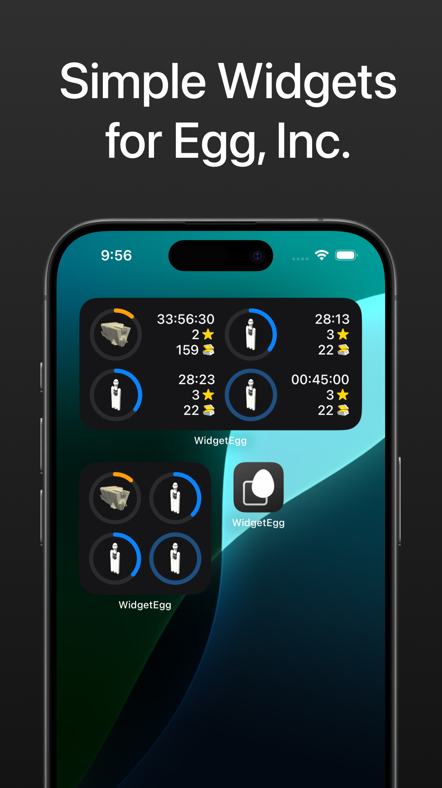
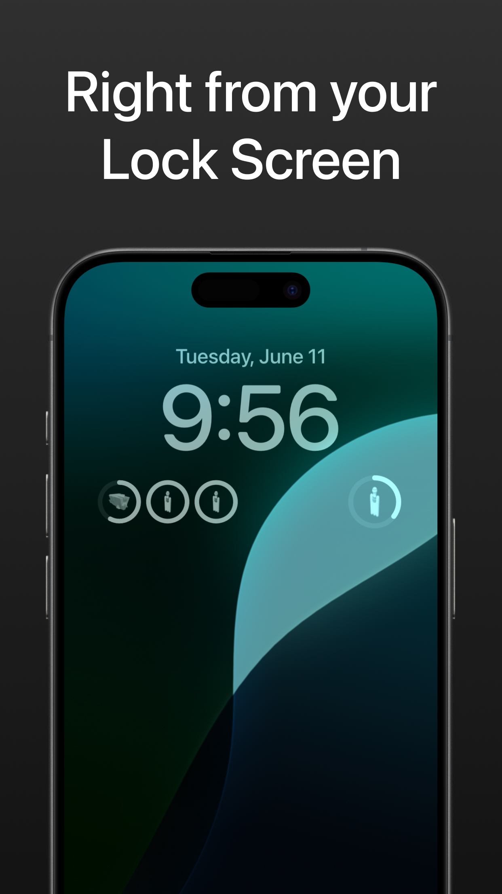
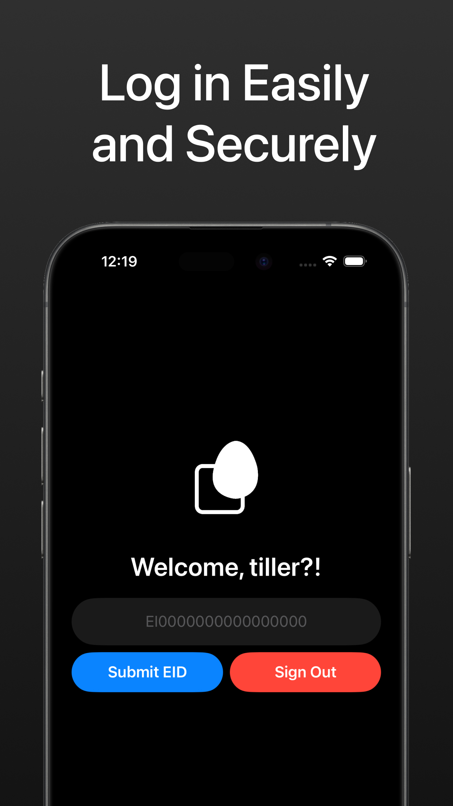
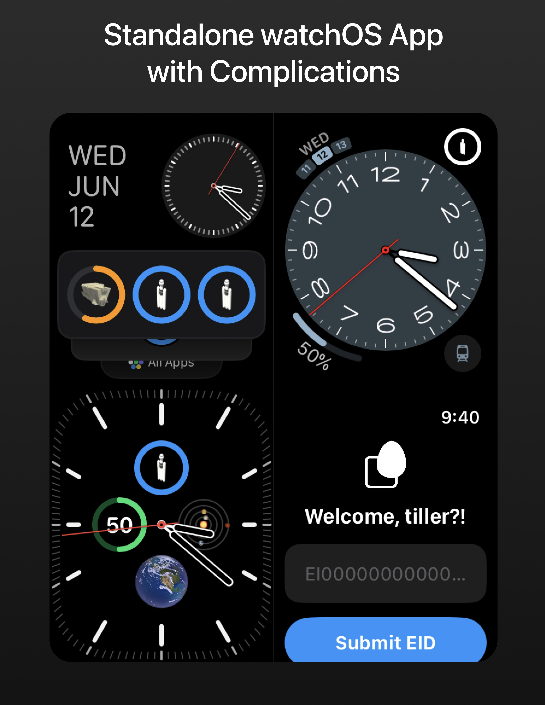

# WidgetEgg

[Download on the App Store](https://apps.apple.com/us/app/widgetegg/id6502221824)

Built for iPhone, iPad, and Apple Watch. Available on Mac.

   
   
   
   

## Building
1. Clone this repository
`git clone https://github.com/tylertms/WidgetEgg`

2. Open `WidgetEgg.xcodeproj` with Xcode and use the integrated build tool.
3. This app uses a private API function in ~/MissionInfo/Tools/SecureAPI.swift. To use that function, you must supply the given environmental variables yourself, which will automatically be injected when building.

   
##
WidgetEgg is an independent app and is not affiliated with or endorsed by Auxbrain, Inc. All trademarks, service marks, and logos pertaining to Egg, Inc are the exclusive property of Auxbrain, Inc. and are not included under this project's license.
